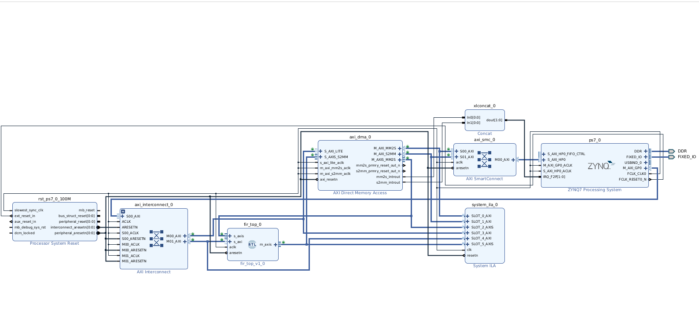
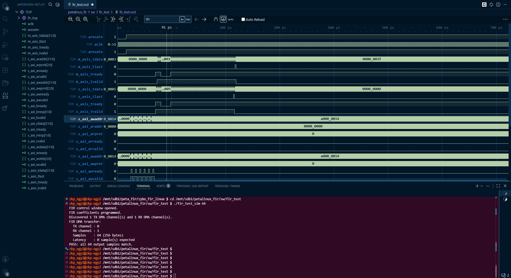
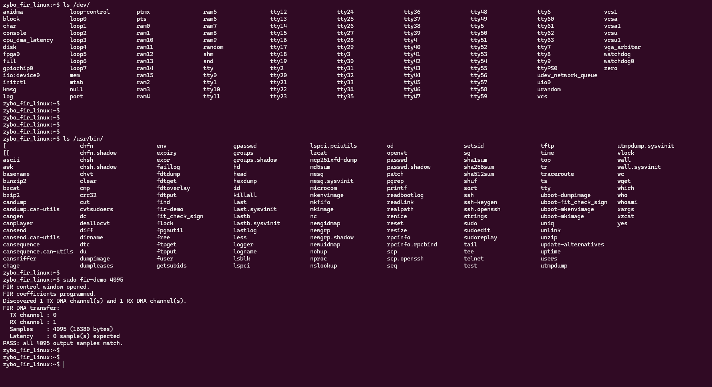
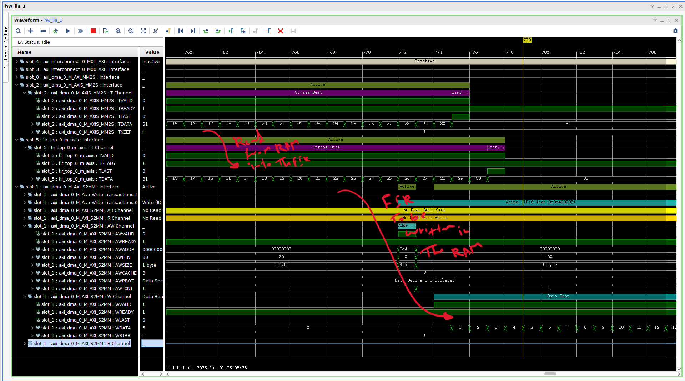
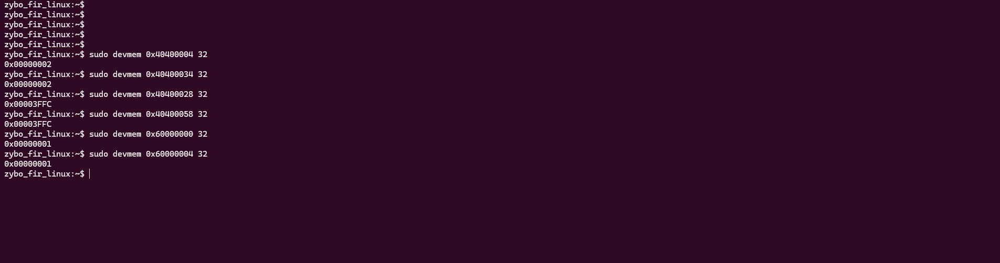

# Petalinux Demo
## Petalinux  + AXI DMA + Accelrator 
This repository captures an end-to-end hardware/software bring-up on a Zybo Zynq7000 platform, using a FIR filter as a convenient dummy hardware accelerator. The FIR block was a good fit because it exposes two streaming interfaces for data movement and an AXI-Lite interface for software configuration.

The goal was not just to instantiate a FIR block, but to prove the full hardware/software path around a simple accelerator shape:

- AXI-Lite control for programming and enable
- AXI-Stream ingress and egress through the custom FIR IP
- AXI DMA movement between PS memory and PL logic
- Linux UIO mapping for the AXI-Lite control window
- Integration and packaging of an open-source AXI DMA driver and userspace library
- Verilator-based pre-silicon checking with a software-driven harness
- PetaLinux packaging and on-target execution of the same demo flow

## Project Stages

### 1. Vivado block design and system integration

The hardware design connects the custom `fir_top` IP to AXI DMA, PS DDR, AXI interconnect fabric, and an ILA for live inspection. This is the system-level view of the project.



### 2. Verilator simulation and protocol bring-up

Before booting hardware, the FIR path was exercised in simulation using the same software test harness that later runs against the board. That made it possible to centralize the SW and RTL behavior in one place: the harness programs the AXI-Lite registers, drives a ramp through a mock DMA layer, and checks the returned samples against the expected result.

This approach was useful because it validated the software flow and the RTL handshake behavior together.



### 3. PetaLinux bring-up and hardware validation

On target, the board boots into PetaLinux, exposes the AXI DMA and UIO interfaces, and runs the `fir-demo` application. The captured run below shows the system enumerating the devices and successfully completing a 4095-sample transfer.



This stage also required Linux-specific plumbing around the accelerator:

- binding the FIR AXI-Lite register block through UIO so userspace can `mmap()` and program it
- building and packaging the open-source AXI DMA kernel driver and userspace library
- wiring the device tree so the DMA and FIR control path are both visible to Linux

The DMA driver stack used here is based on the open-source Xilinx AXI DMA project:

- https://github.com/bperez77/xilinx_axidma

## Petalinux Steps

The PetaLinux customization lives under `meta-user/` and was applied in this chronological order:

1. Run `petalinux-config --get-hw-description <xsa>` to import the Vivado hardware export and generate the hardware description.
2. Add the AXI DMA userspace library recipe in `recipes-apps/libaxidma/` so `fir-demo` can link against `libaxidma`.
3. Add the AXI DMA kernel module recipe in `recipes-modules/axidma/` so the out-of-tree driver builds and installs as `axidma.ko`.
4. Add the boot-time module configuration in `recipes-modules/fir-modules-conf/` so `axidma` and `uio_pdrv_genirq` load automatically and UIO is bound with `of_id=generic-uio`.
5. Add the device-tree overlay in `recipes-bsp/device-tree/files/system-user.dtsi` so the AXI DMA character device and the FIR UIO node are visible to Linux.
6. Run `petalinux-config -c rootfs` to enable the custom rootfs packages, including `axidma`, `libaxidma`, `fir-demo`, and `fir-modules-conf`.
7. Run `petalinux-build` to build the kernel module, userspace library, demo app, device tree, and final image.


### 4. On-boardILA

After the PetaLinux bring-up was working, the internal traffic was checked with an ILA. This was mainly used to watch the end-to-end streaming path through the accelerator: AXI DMA MM2S sourcing data out of PS memory, the FIR consuming that stream on its slave AXI-Stream side, and AXI DMA S2MM capturing the FIR output back into memory.

In other words, the useful hardware question was not just whether DMA was enabled, but whether the packet moved cleanly through all three stages:

- MM2S asserted a valid input stream toward the FIR
- the FIR accepted, processed, and re-framed the packet correctly
- S2MM observed the returned stream with the expected boundary and wrote it back to DDR

That visibility mattered because the main protocol bug was in the FIR stream framing rather than in the AXI DMA driver itself. The ILA made it possible to see whether `TVALID`, `TREADY`, and especially `TLAST` were aligned across the MM2S → FIR → S2MM path.




### 5. Low-level register debug with devmem

For quick bring-up, it is also useful to probe the AXI-Lite register space directly from Linux with `devmem`. That is not a replacement for the userspace demo or the ILA, but it is a fast way to confirm that the DMA control block and FIR control registers are alive at the expected physical addresses.

In this design:

- AXI DMA control base: `0x40400000`
- FIR AXI-Lite control base: `0x60000000`

Typical DMA registers to read are:

- MM2S control: `0x40400000`
- MM2S status: `0x40400004`
- MM2S source address: `0x40400018`
- MM2S transfer length: `0x40400028`
- S2MM control: `0x40400030`
- S2MM status: `0x40400034`
- S2MM destination address: `0x40400048`
- S2MM transfer length: `0x40400058`

Typical FIR control registers to read are:

- FIR control / enable: `0x60000000`
- FIR coefficient 1: `0x60000004`
- FIR coefficient 2: `0x60000008`
- FIR coefficient 3: `0x6000000C`
- FIR coefficient 4: `0x60000010`
- FIR coefficient 5: `0x60000014`

Example reads on the target:

```bash
sudo devmem 0x40400004 32
sudo devmem 0x40400034 32
sudo devmem 0x40400028 32
sudo devmem 0x40400058 32
sudo devmem 0x60000000 32
sudo devmem 0x60000004 32
```



That is especially helpful when you want to distinguish three different classes of failure:

- the DMA control block is not responding at all
- MM2S is launching but S2MM is not seeing a correctly framed return packet
- the FIR AXI-Lite block is mapped correctly but its configuration does not match what the software expects


## What Was Verified

- The FIR control window is reachable from software over AXI-Lite.
- The DMA path can push samples into the FIR and receive output back into PS memory.
- The same basic application flow works in simulation and on hardware.
- The on-board Linux image exposes the expected interfaces, including `/dev/axidma` and the FIR UIO device.
- The FIR AXI-Lite region can be mapped from userspace through UIO and programmed correctly.
- The open-source AXI DMA driver builds, loads, and works with the packaged demo application.
- The demo passes in simulation and on target.

## Repository Contents

- `rtl/` - FIR RTL sources and AXI wrapper logic
- `sw/verialtor/` - shared AXI-Lite and DMA-facing support code used by the demo
- `sw/demo/` - userspace demo, backend seam, and Verilator-oriented build flow
- `vivado/` - project TCL and exported XSA
- `meta-user/` - PetaLinux recipes, UIO/device-tree glue, and AXI DMA driver packaging
- `images/boot/` - BOOT.BIN and U-Boot binaries for JTAG handoff
- `docs/` -screenshots

## Reproducing The Flow

At a high level, the flow is:

1. Build or open the Vivado design and export the hardware platform.
2. Import the XSA into PetaLinux.
3. Apply the `meta-user` recipes, UIO binding, AXI DMA driver packaging, and device-tree overlay.
4. Build the image and boot artifacts, including the open-source AXI DMA driver.
5. Run the userspace demo on the board.
6. Use Verilator and the demo harness for simulation-side checking.

See `docs/workflow.md` for the condensed rebuild path.